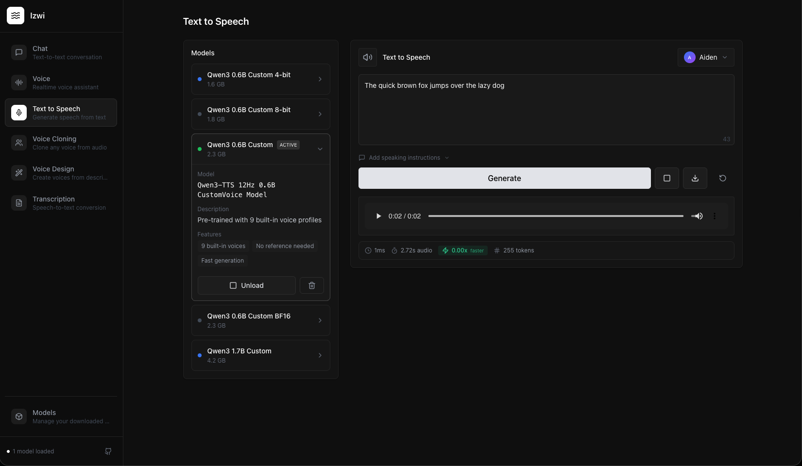

# Izwi - A local audio inference engine

Izwi is a Rust-based local inference stack for speech and audio workflows, with:
- text-to-speech (TTS),
- automatic speech recognition (ASR),
- chat/audio-chat model support,
- a CLI-first workflow (`izwi`), web UI, and Tauri desktop shell.

The server exposes OpenAI-style routes under `/v1` and is easiest to run through the CLI.



## Features

- Local-first audio inference with Rust backend
- CLI for serving, model lifecycle management, TTS, ASR, chat, and benchmarking
- Model download/load/unload flows from Hugging Face
- Web UI (React + Vite) for interactive testing
- Tauri desktop app mode launched from the CLI
- Apple Silicon acceleration support (Metal), with cross-platform native builds

## Requirements

- Rust toolchain (stable; Rust 1.83+ recommended)
- Node.js 18+ and npm (for UI dependencies and local UI dev/build)
- macOS or Linux

Install Rust if needed:

```bash
curl --proto '=https' --tlsv1.2 -sSf https://sh.rustup.rs | sh
source "$HOME/.cargo/env"
rustup update stable
```

## Quick Start (Native)

### 1. Install UI dependencies

```bash
cd ui
npm install
cd ..
```

### 2. Build release binaries

On macOS:

```bash
cargo build --release --features metal
```

On Linux/other platforms:

```bash
cargo build --release
```

### 3. Install CLI + server binaries

```bash
./scripts/install-cli.sh
```

The install script places `izwi`, `izwi-server`, and `izwi-desktop` in `~/.local/bin` by default and updates shell setup.

### 4. Start Izwi

```bash
izwi serve
```

Server URL: `http://localhost:8080`

Desktop mode:

```bash
izwi serve --mode desktop
```

To serve the bundled UI from the same server endpoint, build it once:

```bash
cd ui
npm run build
cd ..
```

### 5. (Optional) Start the UI in dev mode

```bash
cd ui
npm run dev
```

Dev UI URL: `http://localhost:5173`

## Releases

GitHub tag releases build installers and terminal bundles for:
- Windows (`NSIS .exe`),
- Linux (`.deb`, includes `izwi` and `izwi-server` in `/usr/bin`),
- macOS (`.dmg`, unsigned by default until signing is configured; app startup attempts to link `izwi`/`izwi-server` in PATH and may prompt for admin access).

Release process details are in `docs/RELEASING.md`.

## First Commands to Run

Use these to verify end-to-end setup:

```bash
izwi status
izwi list --local
izwi pull qwen3-tts-0.6b-base
izwi tts "Hello from Izwi" --model qwen3-tts-0.6b-base --output /tmp/hello.wav
izwi transcribe data/test.wav --model qwen3-asr-0.6b --format text
```

## CLI Commands (Brief Overview)

`izwi` is the primary interface. Core command groups:

- `serve`: start the local API server
- `list`, `pull`, `rm`, `models ...`: inspect/download/load/unload models
- `tts`: generate speech from text
- `transcribe`: convert audio to text
- `chat`: chat with supported chat/audio-chat models
- `bench`: run throughput and task-specific benchmarks
- `status`: inspect health and runtime state
- `config`: inspect or change CLI configuration

Get full command help:

```bash
izwi --help
izwi models --help
izwi tts --help
izwi transcribe --help
```

## Supported Model Families

The codebase currently includes model variants for:
- Qwen3 TTS (base/custom voice/voice design, including quantized variants),
- Qwen3 ASR (0.6B/1.7B + quantized variants),
- Qwen3 chat (0.6B 4-bit),
- Qwen3 forced aligner,
- Voxtral realtime (coming soon),
- LFM2-Audio (coming soon).

Run `izwi list` to view exact variants and local availability on your machine.

## License

Apache 2.0

## Acknowledgments

- [Qwen3-TTS](https://github.com/QwenLM/Qwen3-TTS) by Alibaba
- [MLX](https://github.com/ml-explore/mlx) by Apple
- [HuggingFace Hub](https://huggingface.co/) for model hosting
